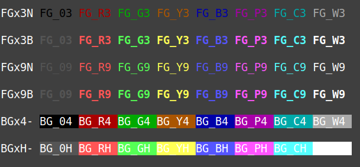

# cli_command_ideas
CLI  commands and patterns ideas


#### SHELL_COMMENTS_IDEA_0001 ( Multiline shell script comments )
```bash
# using (: ')
: '
This is a test comment
Author foo bar
Released under GNU 
'

# using (: <<'EOF')
: <<'EOF'
CODE block starts
CODE block ends here
EOF

# using (command <<'EOF')
true <<'EOF'
This is a multiline comment.
Multiline comment in shell script example.
It can span multiple lines.
EOF

```


#### SHELL_DATE_IDEA_0002 ( date command samples )
| Description | Command | Output |
|-------------|---------|--------|
|YY-MM-DD_hh:mm:ss             | date +%F_%T                | 2026-03-23_06:23:41 |
|YYMMDD_hhmmss                 | date +%Y%m%d_%H%M%S        | 20260323_062341 |
| |
|YYMMDD_hhmmss (UTC version)   | date --utc +%Y%m%d_%H%M%SZ | 20260323_032341Z |
|YYMMDD_hhmmss (with local TZ) | date +%Y%m%d_%H%M%S%Z      | 20260323_062341+03 |
|ISO8601 UTC timestamp         | date --utc +%FT%TZ         | 2026-03-23T03:23:41Z |
|ISO8601 Local TZ timestamp    | date +%FT%T%Z              | 2026-03-23T06:23:41+03 |
|ISO8601 UTC timestamp + ms    | date --utc +%FT%T.%3NZ     | 2026-03-23T03:23:41.304Z |
| |
|YYMMSShhmmss                  | date +%Y%m%d%H%M%S         | 20260323062341 |
|YYMMSShhmmssnnnnnnnnn         | date +%Y%m%d%H%M%S%N       | 20260323062341316051395 |
|Seconds only:                 | date +%S                   | 41 |
|Meliseconds only:             | date +%N \| cut -b1-6      | 325257 |
|Nanoseconds only:             | date +%N                   | 346741323 |
|Day  of year (001..366)       | date +%j                   | 082 |
|Week of year (01..52 )        | date +%U                   | 12 |
| |
|Seconds since UNIX epoch:     | date +%s                   | 1774236221 |
|Nanoseconds since UNIX epoch: | date +%s%N                 | 1774236221369334663 |
|cvt UNIX second to date       | date -d @1234567890        | Sat Feb 14 02:31:30 AM +03 2009 |
|End of Unix time              | date -ud @2147483647       | Tue Jan 19 03:14:07 AM UTC 2038 |


#### SHELL_COLORS_IDEA_0003 ( Show colors on terminal )
```bash
show_colors(){
export CE0="\x1B[0m" CEB="\x1B[1m"
export FG_03="\x1B[30m"  FG_R3="\x1B[31m"  FG_G3="\x1B[32m"  FG_Y3="\x1B[33m"  FG_B3="\x1B[34m"  FG_P3="\x1B[35m"  FG_C3="\x1B[36m"  FG_W3="\x1B[37m"
export FG_09="\x1B[90m"  FG_R9="\x1B[91m"  FG_G9="\x1B[92m"  FG_Y9="\x1B[93m"  FG_B9="\x1B[94m"  FG_P9="\x1B[95m"  FG_C9="\x1B[96m"  FG_W9="\x1B[97m"
export BG_04="\x1B[40m"  BG_R4="\x1B[41m"  BG_G4="\x1B[42m"  BG_Y4="\x1B[43m"  BG_B4="\x1B[44m"  BG_P4="\x1B[45m"  BG_C4="\x1B[46m"  BG_W4="\x1B[47m"
export BG_0H="\x1B[100m" BG_RH="\x1B[101m" BG_GH="\x1B[102m" BG_YH="\x1B[103m" BG_BH="\x1B[104m" BG_PH="\x1B[105m" BG_CH="\x1B[106m" BG_WH="\x1B[107m"
echo
echo -e "FGx3N ${FG_03}FG_03 ${FG_R3}FG_R3 ${FG_G3}FG_G3 ${FG_Y3}FG_Y3 ${FG_B3}FG_B3 ${FG_P3}FG_P3 ${FG_C3}FG_C3 ${FG_W3}FG_W3 ${CE0} \n"
echo -e "FGx3B ${CEB}${FG_03}FG_03 ${FG_R3}FG_R3 ${FG_G3}FG_G3 ${FG_Y3}FG_Y3 ${FG_B3}FG_B3 ${FG_P3}FG_P3 ${FG_C3}FG_C3 ${FG_W3}FG_W3 ${CE0} \n"
echo -e "FGx9N ${FG_09}FG_09 ${FG_R9}FG_R9 ${FG_G9}FG_G9 ${FG_Y9}FG_Y9 ${FG_B9}FG_B9 ${FG_P9}FG_P9 ${FG_C9}FG_C9 ${FG_W9}FG_W9 ${CE0} \n"
echo -e "FGx9B ${CEB}${FG_09}FG_09 ${FG_R9}FG_R9 ${FG_G9}FG_G9 ${FG_Y9}FG_Y9 ${FG_B9}FG_B9 ${FG_P9}FG_P9 ${FG_C9}FG_C9 ${FG_W9}FG_W9 ${CE0} \n"
echo -e "BGx4- ${BG_04}BG_04 ${BG_R4}BG_R4 ${BG_G4}BG_G4 ${BG_Y4}BG_Y4 ${BG_B4}BG_B4 ${BG_P4}BG_P4 ${BG_C4}BG_C4 ${BG_W4}BG_W4 ${CE0} \n"
echo -e "BGxH- ${BG_0H}BG_0H ${BG_RH}BG_RH ${BG_GH}BG_GH ${BG_YH}BG_YH ${BG_BH}BG_BH ${BG_PH}BG_PH ${BG_CH}BG_CH ${BG_WH}BG_WH ${CE0} \n"
echo
}
```



#### SHELL_ARGUMENTS_IDEA_0004 ( Use shift to consume positional parameters )
```bash
NNAME=$1; shift
R1=$1; shift
R2=$1; shift
F1=$1; shift
F2=$1
```


#### SHELL_ARGUMENTS_IDEA_0005 ( ${!1} is Value of parameter name $1 )
```bash
echo "Arg1_Name=$1 and Arg1_Value=${!1}" # Arg1_Name=HOME and Arg1_Value=/home/user1
```


#### SHELL_FUNCTION_IDEA_0006 ( Single line function must end with ; } )
```bash
function hello1() {  echo "Hello, World!"; } # (end with ; })
```


#### SHELL_CODE_IDEA_0007 ( strings comparing )

```bash
    if [$string1 = $string2]:  This checks if string1 is identical to string2

    if [$string1 != $string2]: This checks if string1 is not identical to string2
    if ! [ "mokhtar" = "Mokhtar" ]

    if [$string1 \< $string2]: This checks if string1 is less than string2
    if [$string1 \> $string2]: This checks if string1 is greater than string2
```


#### SHELL_CODE_IDEA_0008 ( Run if variable contains a specific string )
```bash
if [[ $T_OPTIONS == *"unMounting"* ]]
then
echo
echoStatusI 'begin unMounting '
sudo umount -l  $MY_MP
echoStatusI 'End   unMounting '
fi
```


#### SHELL_CODE_IDEA_0009 ( Run debend on the previous command status. )
```bash
echo "" # command

T_RESULT=$?
if [ $T_RESULT -eq 0 ]
then
  echo success
else
  echo failed
fi

# ( O R )

if [ $T_RESULT == 0 ]; then
  echo success 2
else
  echo failed 2
fi
```


#### SHELL_SUDO_IDEA_0010 ( Change system file content which need root privilege. )
```bash
# Overwite
sudo sh -c "echo '1'     >             /proc/sys/net/ipv6/conf/all/disable_ipv6" # Enable IPv6 Temporarily	
            echo '0'     | sudo tee    /proc/sys/net/ipv6/conf/all/disable_ipv6  # Disable IPv6 Temporarily	

# Append
sudo sh -c "echo 'log_3' >>            /tmp/log_file"            
            echo 'log_4' | sudo tee -a /tmp/log_fil
```


#### SHELL_PYTHON_IDEA_0011 ( call Python script or Python function with arguments. )
```bash
python3 python_script.py 4 9
13
export NUM1=2 NUM2=5 ; python3 -c "import os,python_script; print(python_script.sum(os.environ['NUM1'],os.environ['NUM2']))"
7
```
Where python_script.py is:
```python
# python_script.py

import sys
import os

def sum(N1,N2):
    return int(N1) + int(N2)

def main():
    if len(sys.argv) >= 3:
        print(sum(sys.argv[1], sys.argv[2]))
        return

if __name__ == "__main__":
    main()
```    
